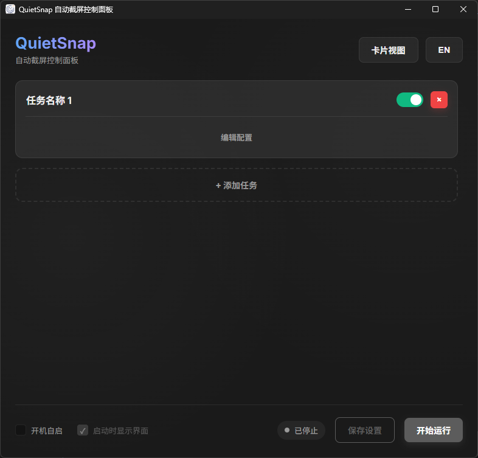
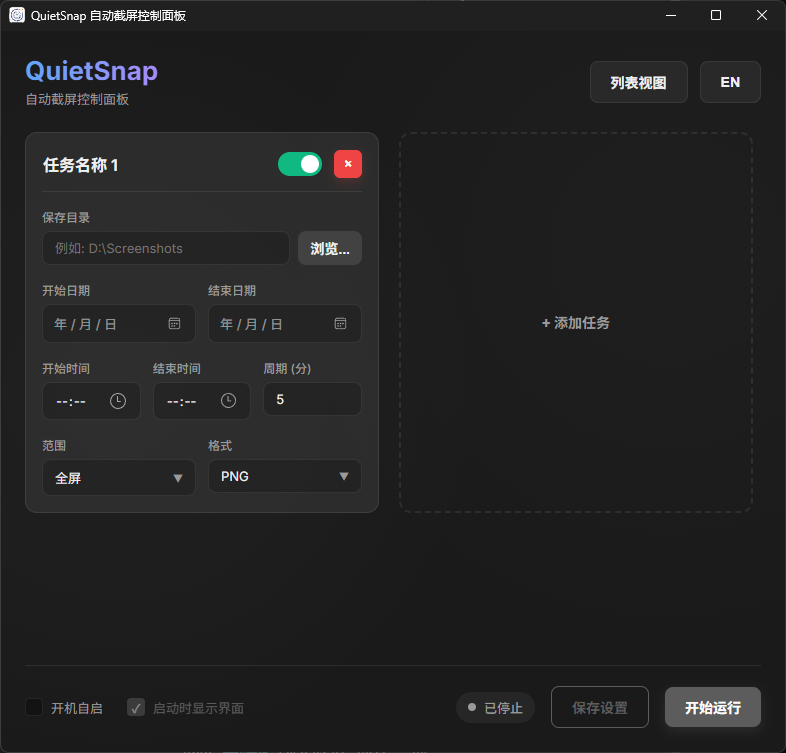

# QuietSnap 🚀

[](README.md)

QuietSnap 是一款开源、跨平台的自动化后台截屏工具。基于 **Wails v3**、**Vue 3** 和 **Go** 构建。拥有绝美的暗黑毛玻璃风格（Glassmorphism）用户界面，让你能够轻松定制专属于你工作时间的后台静默截图计划。

---

## 🎯 为什么选择 QuietSnap？（解决的痛点）

你是否曾经需要长时间记录屏幕活动，却发现市面上的工具总是难以满足需求？
- **告别臃肿的录屏文件**：录屏会产生几 GB 甚至几十 GB 的超大视频文件。QuietSnap 采用定时截图的方式，极大地节省了磁盘空间，且画质依然清晰。
- **杜绝非工作时间的资源浪费**：绝大多数截图/录屏工具一旦开启就会 24 小时运行。QuietSnap 引入了 **“每日活跃时间窗口”**（例如：设定只在每天 09:00 - 18:00 截屏）。在设定时间之外，程序会自动进入休眠状态，不占用任何多余的系统性能与电量。
- **告别老旧丑陋的界面**：QuietSnap 采用最前沿的现代 Web 技术构建，提供了一个极简、沉浸且无干扰的现代化界面。

---

## 🌟 核心特性

- **高级时间调度**：支持设置全局的开始/结束日期，并可精确指定每天的活跃时间段。
- **自定义区域框选**：内置半透明全屏遮罩，只需鼠标轻轻一拖，即可精准截取屏幕任意区域。
- **系统托盘静默运行**：原生支持最小化到系统托盘，在后台安静执行任务，绝不打扰你的正常工作。
- **多语言无缝切换**：原生支持中文与英文，并在界面内提供了一键无缝切换功能。
- **开机自启**：支持配置开机自动启动，且可选择启动时是否展示主界面。
- **现代化 UI**：全暗黑模式（Dark Mode），优雅的字体排版，由 Vue 3 强力驱动的响应式组件。

---

## 💻 技术栈

- **后端**: [Go](https://go.dev/) & [Wails v3](https://v3.wails.io/)
- **前端**: [Vue 3](https://vuejs.org/) + [TypeScript](https://www.typescriptlang.org/) + 纯原生 CSS (零臃肿框架)
- **构建工具**: Node.js, npm, Vite

---

## 📸 界面预览




---

## 🚀 快速开始

### 环境依赖

1. 安装 **Go** (1.20及以上版本)
2. 安装 **Node.js** (18及以上版本)
3. 安装 **Wails v3 命令行工具**:
   ```bash
   go install github.com/wailsapp/wails/v3/cmd/wails3@latest
   ```

### 开发模式运行

```bash
wails3 dev
```

### 编译生产版本

如果你想要编译出一个独立的可执行文件 (.exe / .app):

```bash
wails3 build
```
或者使用手动分步编译法（Windows 示例）:
```bash
# 1. 编译前端
cd frontend
npm install
npm run build

# 2. 编译后端
cd ..
go build -tags desktop,production -ldflags="-H windowsgui -s -w" -o Autoscreen.exe
```

---

## 📖 使用指南

1. 启动 **QuietSnap**。
2. 选择你希望保存截图的 **保存目录**。
3. 配置好 **开始日期/结束日期** 以及你的 **每日开始时间/结束时间** 窗口。
4. 设定截图的时间间隔（如每 5 分钟）。
5. 选择截图范围（全屏或拖拽框选自定义区域）。
6. 点击 **开始自动截图**。程序将自动最小化至托盘，并按照你的作息时间安静地记录一切！

---

## 📜 开源协议

本项目开源，采用 [MIT 许可证](LICENSE)。
