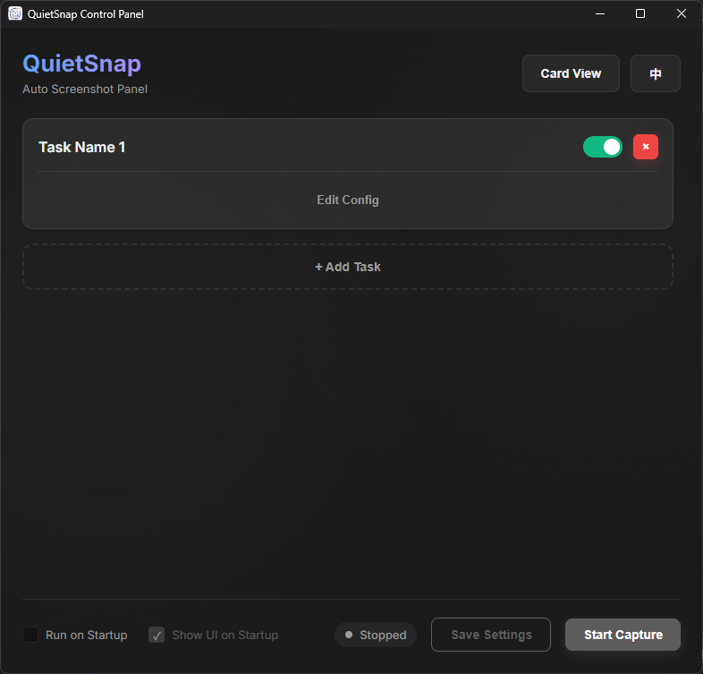
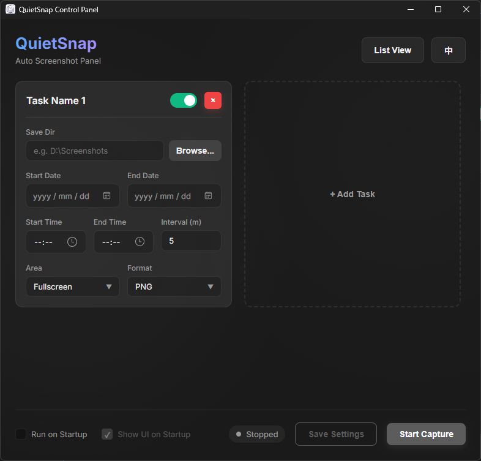

# QuietSnap 🚀

[](README_zh.md)

QuietSnap is an open-source, cross-platform automated screenshot utility built with **Wails v3**, **Vue 3**, and **Go**. With a beautiful Dark Mode (Glassmorphism) UI, it allows you to effortlessly schedule background screenshot captures tailored to your exact active working hours.

---

## 🎯 Why QuietSnap? (Pain Points Solved)

Have you ever needed to automatically record your screen over a long period, but found existing solutions lacking?
- **No more massive video files**: Instead of recording gigabytes of video, QuietSnap takes lightweight screenshots at your chosen interval, saving massive amounts of disk space.
- **No more wasted resources outside of work hours**: Most screenshot tools run 24/7 once started. QuietSnap introduces **Daily Active Time Windows** (e.g., 09:00 - 18:00). It intelligently sleeps outside of this window, preserving system performance and saving power.
- **No more bulky, outdated UIs**: QuietSnap is built with modern web technologies, offering a sleek, distraction-free, and natively responsive interface.

---

## 🌟 Features

- **Advanced Time Scheduling**: Set global start/end dates and specify a daily active time window.
- **Custom Region Selector**: Easily draw a rectangle anywhere on your screen to capture a specific area.
- **System Tray Integration**: Native support for minimizing to the system tray, running silently in the background.
- **Multi-language Support**: Switch between English and Chinese seamlessly within the UI.
- **Auto-Start**: Optionally configure the app to run on startup.
- **Modern UI**: Full Dark Mode, elegant typography, and responsive controls built with Vue 3.

---

## 💻 Tech Stack

- **Backend**: [Go](https://go.dev/) & [Wails v3](https://v3.wails.io/)
- **Frontend**: [Vue 3](https://vuejs.org/) + [TypeScript](https://www.typescriptlang.org/) + Vanilla CSS (No bulky frameworks)
- **Tooling**: Node.js, npm, Vite

---

## 📸 Screenshots




---

## 🚀 Getting Started

### Prerequisites

1. Install **Go** (1.20+)
2. Install **Node.js** (18+)
3. Install **Wails v3 CLI**:
   ```bash
   go install github.com/wailsapp/wails/v3/cmd/wails3@latest
   ```

### Running in Development

```bash
wails3 dev
```

### Building for Production

To build a standalone executable:

```bash
wails3 build
```
Or use the manual compilation method:
```bash
# Build Frontend
cd frontend
npm install
npm run build

# Build Backend (Windows)
cd ..
go build -tags desktop,production -ldflags="-H windowsgui -s -w" -o Autoscreen.exe
```

---

## 📖 Usage

1. Launch **QuietSnap**.
2. Select your desired **Save Directory** for the screenshots.
3. Configure your **Start/End Date** and your **Daily Active Time** window.
4. Set the interval (in minutes).
5. Choose whether to capture the full screen or a custom drawn region.
6. Click **Start Capture**. The app will minimize to the tray and quietly capture screenshots on schedule!

---

## 📜 License

This project is open-source and available under the [MIT License](LICENSE).
